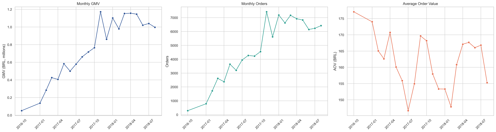
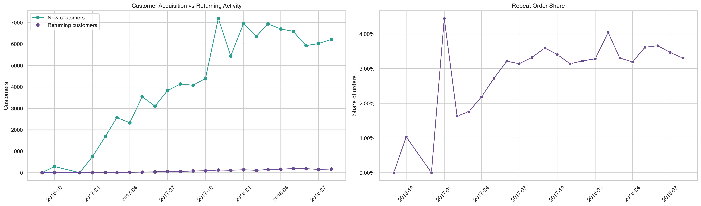
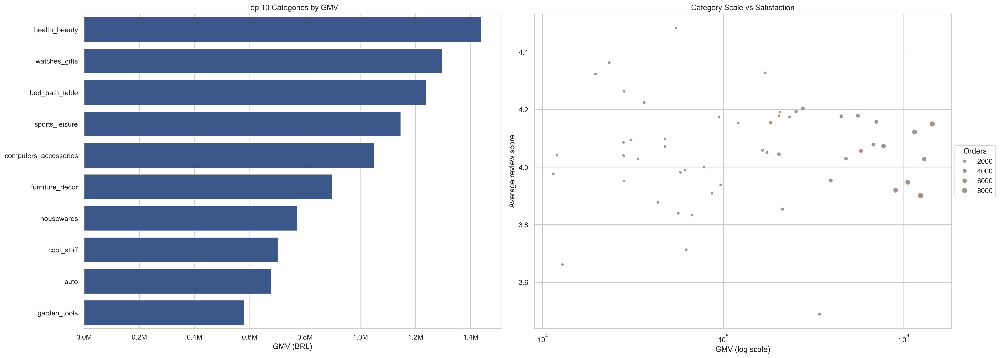
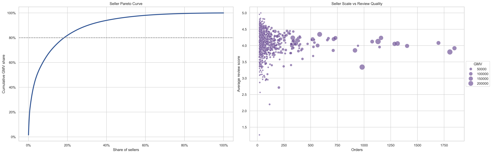
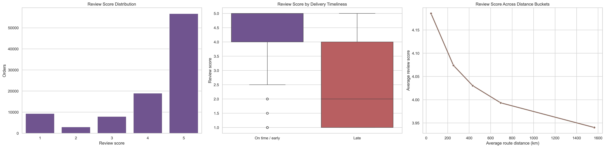
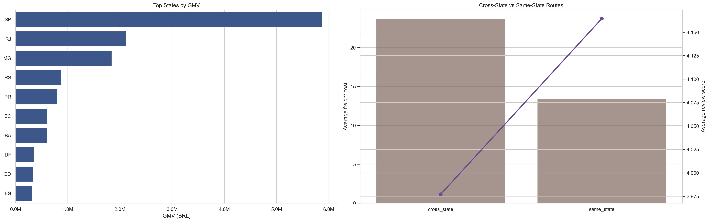
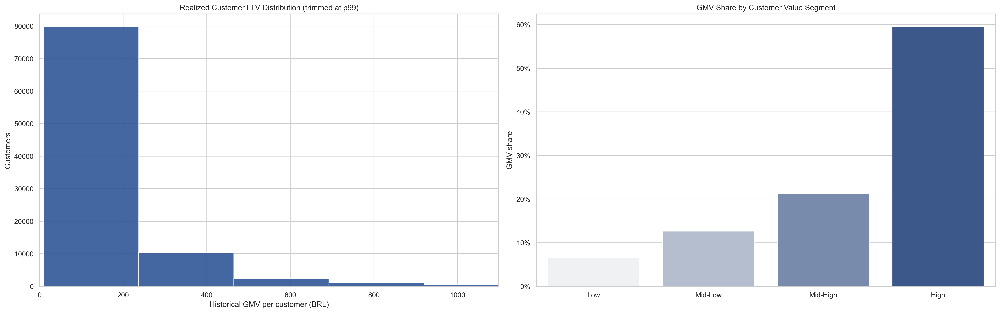
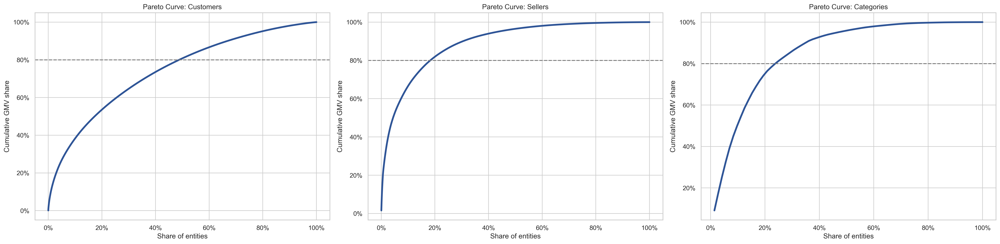
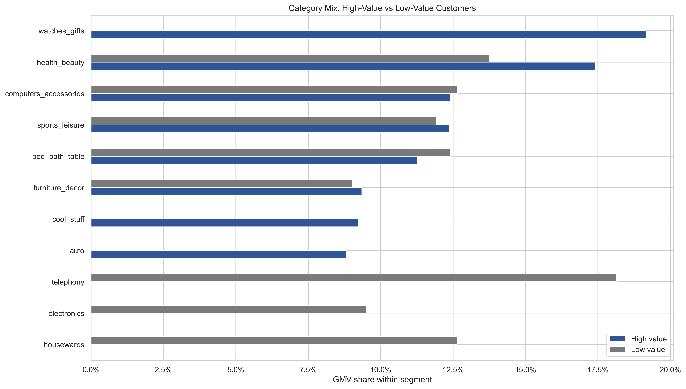

# Brazilian E-Commerce Marketplace Analysis

This is an end-to-end project that I developed using the Olist Brazilian e-commerce dataset.

This project combines:
- exploratory data analysis,
- customer behavior analytics,
- retention analysis,
- experimentation,
- marketplace strategy,
- and predictive modeling

to investigate the main drivers of marketplace GMV growth, retention, seller concentration, and operational performance.

---

## Business Problem

Marketplace growth alone does not guarantee long-term platform sustainability.

This project investigates how Olist's marketplace performance is distributed across customers, sellers, categories, regions, and logistics routes. The goal is to identify where value is concentrated, where operational friction appears, and which strategic actions could support stronger retention and long-term customer value.

The main business questions are:

- What drives marketplace GMV growth over time?
- Is growth supported by repeat purchasing behavior or mainly by new customer acquisition?
- How concentrated is marketplace value across customers, sellers, and categories?
- Which product categories should receive more investment, operational improvement, or monitoring?
- How are delivery delays, freight intensity, and distance related to customer satisfaction?
- Can a simulated discount campaign improve customer conversion and short-term GMV?
- Which operational and transactional features are most useful for predicting order-level GMV?

---

## Executive Summary

The analysis shows a marketplace with strong historical GMV activity, but structurally weak customer retention.

Key findings include:

- Only **3.0%** of customers place more than one order.
- Average month-1 cohort retention is approximately **0.44%** among cohorts with at least 100 customers.
- The highest-value customer segment contributes roughly **59%** of total marketplace GMV.
- Seller and category GMV follow clear concentration patterns, creating opportunities for focused marketplace management.
- **health_beauty** is the largest category by GMV, while **SP** is the primary demand state.
- Late deliveries and longer customer-seller distances are consistently associated with weaker review scores.
- The simulated discount campaign improves conversion by **0.16 percentage points**, but the short-term GMV uplift is only **BRL 0.02 per user**.
- The predictive model captures part of the commercial signal, with **MAE ≈ BRL 64**, **median absolute error ≈ BRL 26**, and **R² ≈ 0.37**.

> **GMV note:** Throughout this project, GMV is used as a proxy for marketplace transaction volume, calculated from item price plus freight value. The dataset does not include Olist's actual commission revenue, contribution margin, advertising spend, inventory costs, or operational costs.

---

## Dataset

Dataset: **Olist Brazilian E-Commerce Public Dataset**

The project uses the following data sources from the Olist dataset:

- orders
- customers
- sellers
- products
- order items
- payments
- reviews
- geolocation
- product category translation

The raw CSV files are expected inside the `olist_data/` folder.

---

## Project Workflow

The project is organized into a reproducible SQL + Python workflow:

1. Create the PostgreSQL database.
2. Create raw Olist tables.
3. Import CSV files into PostgreSQL.
4. Create analytical SQL views.
5. Validate tables, views, and key metrics.
6. Run the main analytical notebook.

---

## Repository Structure

```text
.
├── images/
│   ├── ab_test_results.png
│   ├── category_scale_satisfaction.png
│   ├── category_strategy_by_value_segment.png
│   ├── cohort_retention.png
│   ├── customer_acquisition_vs_repeat_behavior.png
│   ├── customer_ltv_distribution_segments.png
│   ├── logistics_satisfaction_patterns.png
│   ├── marketplace_value_concentration.png
│   ├── monthly_growth_kpis.png
│   ├── predictive_modeling.png
│   ├── regional_gmv_route_economics.png
│   └── seller_concentration_quality.png
│
├── notebooks/
│   ├── import_data_to_postgre.ipynb
│   └── marketplace_gmv_and_retention_analysis.ipynb
│
├── olist_data/
│   ├── olist_customers_dataset.csv
│   ├── olist_geolocation_dataset.csv
│   ├── olist_order_items_dataset.csv
│   ├── olist_order_payments_dataset.csv
│   ├── olist_order_reviews_dataset.csv
│   ├── olist_orders_dataset.csv
│   ├── olist_products_dataset.csv
│   ├── olist_sellers_dataset.csv
│   └── product_category_name_translation.csv
│
├── sql/
│   ├── 01_create_database.sql
│   ├── 02_create_tables.sql
│   ├── 03_create_views.sql
│   └── 04_validation_queries.sql
│
├── .gitignore
├── README.md
└── requirements.txt
```

Local files such as `.env`, `.vscode/`, and SQLTools session files are ignored to avoid exposing local configuration or credentials.

---

## Tech Stack

- Python
- PostgreSQL
- SQLAlchemy
- python-dotenv
- Pandas
- NumPy
- Matplotlib
- Seaborn
- SciPy
- Scikit-learn
- Lifetimes
- Jupyter Notebook

---

## How to Run

### 1. Clone the repository

```bash
git clone https://github.com/okinileo/ecommerce-olist.git
cd ecommerce-olist
```

### 2. Install dependencies

```bash
pip install -r requirements.txt
```

### 3. Create a `.env` file

Create a `.env` file in the project root:

```env
POSTGRES_USER=postgres
POSTGRES_PASSWORD=your_password_here
POSTGRES_HOST=localhost
POSTGRES_PORT=5432
POSTGRES_DB=olist_marketplace
```

Do not commit this file to GitHub.

### 4. Create the PostgreSQL database

Run this file connected to the default `postgres` database:

```text
sql/01_create_database.sql
```

### 5. Create raw tables

Connect to the `olist_marketplace` database and run:

```text
sql/02_create_tables.sql
```

### 6. Import the CSV files

Run the import notebook:

```text
notebooks/import_data_to_postgre.ipynb
```

This notebook loads the CSV files from `olist_data/` into PostgreSQL.

### 7. Create analytical views

After importing the data, run:

```text
sql/03_create_views.sql
```

### 8. Validate the database

Run:

```text
sql/04_validation_queries.sql
```

This checks raw table counts, analytical views, purchase coverage, repeat customer rate, category performance, and cohort retention outputs.

### 9. Run the main notebook

Open and run:

```text
notebooks/marketplace_gmv_and_retention_analysis.ipynb
```

---

## Notebook Structure

```text
Executive Summary

1. Business Understanding
   - Core business questions
   - Business objectives
   - Working hypotheses

2. Environment Setup

3. Data Preparation
   - Data integration
   - Order-level feature engineering
   - Customer-level aggregation
   - Marketplace KPI tables
   - Cohort retention table

4. Exploratory Data Analysis
   - Marketplace growth over time
   - Customer acquisition vs repeat behavior
   - Category scale, concentration, and satisfaction
   - Seller concentration and operational quality
   - Logistics performance and customer satisfaction
   - Regional GMV and route economics
   - Cohort retention over time

5. Customer Lifetime Value
   - Realized historical LTV
   - Probabilistic customer lifetime modeling

6. Experimentation
   - Simulated A/B test design
   - Treatment assignment and uplift simulation
   - Financial outcomes and statistical testing
   - Experiment visualization

7. Product and Business Strategy
   - Marketplace value concentration
   - Category strategy by customer value segment

8. Predictive Modeling
   - Model dataset preparation
   - Model training and evaluation
   - Model interpretation and feature importance

9. Strategic Recommendations and Business Implications
```

---

## Key Visualizations

### 1. Marketplace Growth Over Time

Tracks GMV, order volume, and average order value across the marketplace timeline.



---

### 2. Customer Acquisition vs Repeat Behavior

Compares new customer activity with returning customer behavior and monthly repeat order share.



---

### 3. Category Scale, Concentration, and Satisfaction

Shows top categories by GMV and compares category scale with customer satisfaction and freight intensity.



---

### 4. Seller Concentration and Operational Quality

Evaluates seller GMV concentration and the relationship between seller scale and review quality.



---

### 5. Logistics Performance and Customer Satisfaction

Analyzes review score distribution, delivery timeliness, and how distance buckets relate to customer satisfaction.



---

### 6. Regional GMV and Route Economics

Compares state-level GMV concentration and cross-state versus same-state route economics.



---

### 7. Cohort Retention Over Time

Shows how customer retention evolves after the first purchase month.


---

### 8. Customer LTV Distribution and Segments

Shows realized historical customer value and how GMV is distributed across customer value segments.



---

### 9. Simulated A/B Test Results

Visualizes conversion rate, GMV per user, and discount cost per user for control and treatment groups.


---

### 10. Marketplace Value Concentration

Compares Pareto concentration curves across customers, sellers, and categories.



---

### 11. Category Strategy by Customer Value Segment

Compares category mix between high-value and low-value customers and supports investment, fix, or monitoring decisions.



---

### 12. Predictive Modeling

Compares predicted versus actual order GMV and summarizes the most important feature groups.


---

## Main Business Insights

- Marketplace activity is commercially meaningful, but customer retention is structurally weak.
- Growth appears much more dependent on continuous acquisition than on repeat purchasing behavior.
- High-value customers contribute disproportionately to total marketplace GMV.
- Seller and category concentration suggest that targeted marketplace management can create more impact than broad, unfocused actions.
- Logistics quality is strongly associated with customer review performance.
- High-scale categories with weaker review indicators should be fixed operationally before receiving aggressive growth investment.
- Discount incentives can improve conversion in the simulation, but short-term GMV impact remains limited after discount costs.
- Product characteristics and basket composition are more useful for GMV prediction than geography alone.

---

## Predictive Modeling Results

The project includes a lightweight Random Forest model to predict order-level GMV using basket structure, product mix, seller geography, route structure, and payment behavior.

Model results:

| Metric | Value |
|---|---:|
| MAE | ~BRL 63.72 |
| Median Absolute Error | ~BRL 25.85 |
| R² | ~0.37 |
| Sampled Orders | 40,000 |

Most important feature groups:

1. product weight
2. payment installments
3. product category
4. product volume
5. item count

The model should be interpreted as a practical forecasting aid for GMV banding and operational prioritization, not as a precise pricing or demand prediction system.

---

## Strategic Recommendations

- Invest in high-scale and high-satisfaction categories such as **health_beauty**, **sports_leisure**, and **cool_stuff**.
- Improve operational quality in large but weaker-experience categories such as **watches_gifts**, **bed_bath_table**, and **computers_accessories**.
- Focus on second-purchase activation, since retention is the main structural weakness.
- Build seller quality scorecards combining GMV, review score, late-delivery rate, and delivery reliability.
- Improve regional seller density and inventory positioning to reduce cross-state logistics friction.
- Shift future optimization from pure GMV growth toward contribution margin and long-term customer value.

---

# How to Run

Clone the repository:

```bash
git clone https://github.com/okinileo/ecommerce-olist.git
```

Install dependencies:

```bash
pip install -r requirements.txt
```

Open the notebook:

```bash
jupyter notebook
```

---

# Author

Leonardo Ferreira

Aspiring Data Scientist focused on:
- marketplace analytics
- customer analytics
- retention analysis
- experimentation
- predictive modeling
- business intelligence
