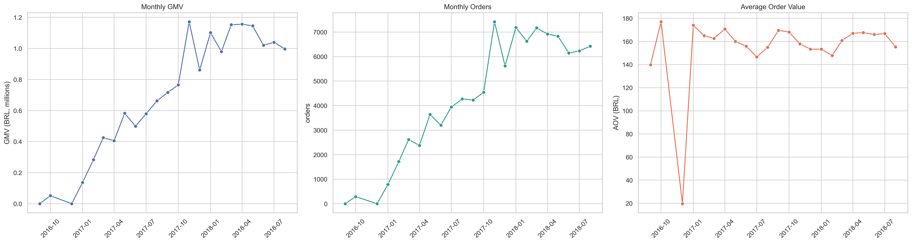
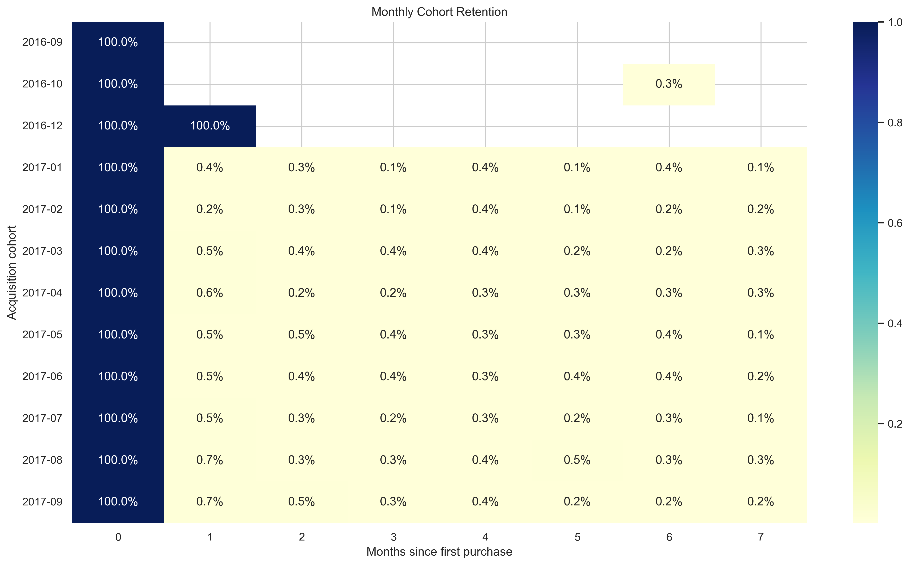
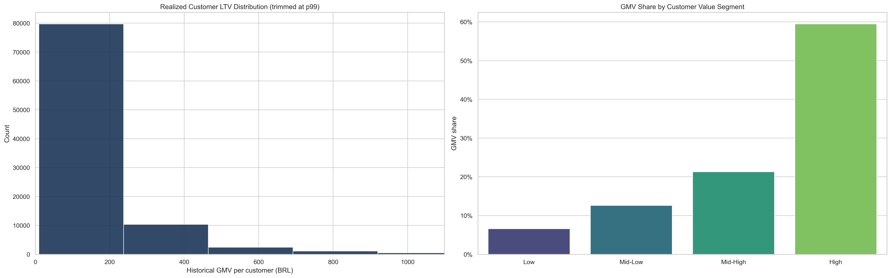
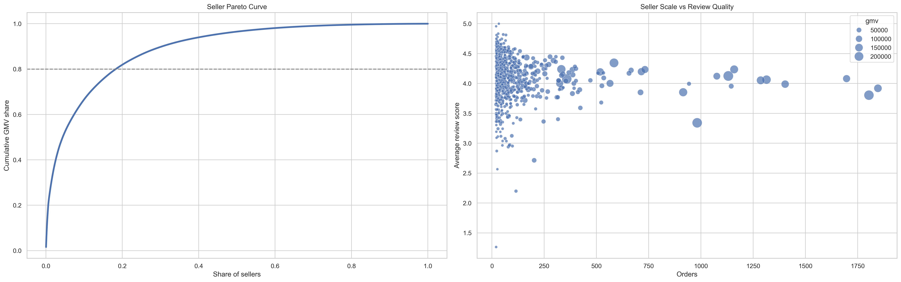
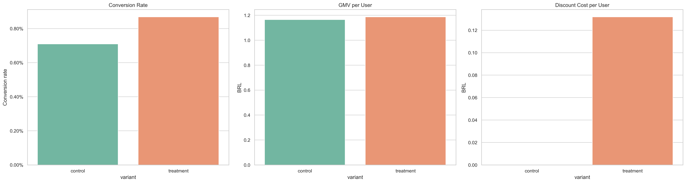
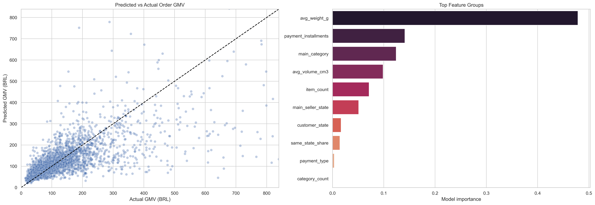

# Brazilian E-Commerce Marketplace Analysis

End-to-end marketplace analytics project using the Olist Brazilian e-commerce dataset.

This project combines:
- exploratory data analysis,
- customer behavior analytics,
- retention analysis,
- experimentation,
- marketplace strategy,
- and predictive modeling

to investigate the main drivers of marketplace GMV growth, retention, seller concentration, and operational performance.

---

# Business Problem

Marketplace growth alone does not guarantee long-term platform sustainability.

This project investigates questions such as:

- What drives marketplace GMV growth?
- How concentrated is marketplace GMV across customers and sellers?
- How weak is customer retention?
- Which categories deserve investment versus operational improvement?
- Can promotional incentives improve customer conversion?
- Which operational variables best predict order-level GMV?

---

# Executive Summary

The analysis reveals a marketplace with strong historical GMV growth but structurally weak customer retention.

Key findings include:

- Only ~3% of customers place more than one order.
- The top customer segment contributes nearly 60% of total marketplace GMV.
- Seller concentration follows a strong Pareto dynamic.
- Delivery quality and logistics reliability directly affect customer reviews.
- Simulated discount campaigns improve conversion modestly, but generate limited short-term GMV gains.
- Product characteristics and basket composition are stronger GMV predictors than geography alone.

> **GMV note:** Throughout this project, GMV is used as a proxy for marketplace transaction volume, calculated as item price plus freight value. The dataset does not provide Olist's actual platform revenue, commissions, contribution margins, or operational costs.

---

# Dataset

Dataset: Olist Brazilian E-Commerce Public Dataset (Kaggle)

The project integrates:
- orders
- customers
- sellers
- products
- payments
- reviews
- geolocation
- freight-related variables

---

# Project Structure

```plaintext
Executive Summary
   - Main Findings

1. Business Understanding
   - Core business questions
   - Working hypotheses

Business Objectives

2. Environment Setup

3. Data Preparation
   - 3.1 Data Integration and Enrichment
   - 3.2 Order-Level Feature Engineering
       - 3.2.1 Delivery and Time-Based Features
       - 3.2.2 Item-Level Commercial and Logistics Features
       - 3.2.3 Geographic Distance Features
       - 3.2.4 Order-Level Aggregation
   - 3.3 Customer-Level Aggregation
   - 3.4 Marketplace KPI Tables
       - 3.4.1 Monthly Growth Metrics
       - 3.4.2 Customer Acquisition and Repeat Mix
       - 3.4.3 Category and Seller KPI Tables
       - 3.4.4 Geographic, Route, and Distance Summaries
       - 3.4.5 Cohort Retention Table

4. Exploratory Data Analysis
   - 4.1 Marketplace Growth Over Time
   - 4.2 Customer Acquisition vs Repeat Behavior
   - 4.3 Category Scale, Concentration, and Satisfaction
   - 4.4 Seller Concentration and Operational Quality
   - 4.5 Logistics Performance and Customer Satisfaction
   - 4.6 Regional GMV and Route Economics
   - 4.7 Cohort Retention Over Time

5. Customer Lifetime Value (LTV)
   - 5.1 Probabilistic Customer Lifetime Modeling

6. Experimentation: Simulated A/B Test
   - 6.1 Experiment Design and Eligible Population
   - 6.2 Treatment Assignment and Simulated Uplift
   - 6.3 Financial Outcomes and Statistical Testing
   - 6.4 Experiment Results Visualization

7. Product and Business Strategy
   - 7.1 Marketplace Value Concentration
   - 7.2 Category Strategy by Customer Value Segment

8. Predictive Modeling: GMV Prediction
   - Model Dataset Preparation
   - Model Training and Evaluation
   - Model Interpretation and Feature Importance

9. Strategic Recommendations and Business Implications
   - Key Findings
   - Strategic Recommendations
   - Trade-Offs and Limitations
   - Next Steps
```

---

# Tech Stack

- Python
- Pandas
- NumPy
- Matplotlib
- Seaborn
- Scikit-learn
- SciPy
- Jupyter Notebook

---

# Key Visualizations

## Marketplace Growth

Tracks the evolution of marketplace GMV, order volume, and average order value over time.



---

## Cohort Retention Analysis

Customer retention drops sharply after the first purchase, revealing strong dependence on continuous customer acquisition.



---

## Customer Lifetime Value Distribution

Marketplace GMV is heavily concentrated among high-value customers.



---

## Seller Concentration and Review Quality

A relatively small group of sellers drives most marketplace GMV.



---

## Simulated A/B Test

Evaluates whether a discount incentive can improve customer conversion and downstream GMV performance.



---

## Predictive Modeling

Random Forest model predicting order-level GMV using operational and transactional variables.



---

# Main Business Insights

- Marketplace GMV growth is strong, but retention remains the platform’s main structural weakness.
- High-value customers disproportionately drive marketplace GMV.
- Large operational categories require quality improvements rather than pure scaling.
- Seller concentration creates potential platform dependency risk.
- Logistics performance strongly affects customer satisfaction.
- Promotional incentives improve conversion more than short-term GMV efficiency.

---

# Predictive Modeling Results

Model:
- Random Forest Regressor

Performance:
- MAE: ~63.7 BRL
- Median Absolute Error: ~25.9 BRL
- R²: ~0.37

Most important predictors:
- product weight
- payment installments
- category
- product volume
- item count

---

# Strategic Recommendations

- Improve second-purchase activation and retention loops.
- Expand investment in high-performing categories.
- Improve operational quality in large but lower-rated categories.
- Reduce logistics friction and delivery delays.
- Monitor seller concentration risk.
- Shift optimization focus from pure GMV growth toward long-term customer value.

---

# How to Run

Clone the repository:

```bash
git clone https://github.com/okinileo/ecommerce-olist.git
```

Install dependencies:

```bash
pip install -r requirements.txt
```

Open the notebook:

```bash
jupyter notebook
```

---

# Author

Leonardo Bernardo

Aspiring Data Scientist focused on:
- marketplace analytics
- experimentation
- predictive modeling
- business intelligence
- customer analytics
